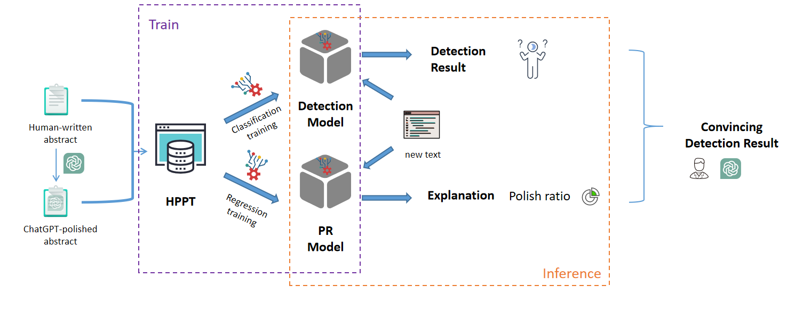

# ChatGPT-Detection-PR-HPPT 
This our dataset and code for the paper: [Is ChatGPT Involved in Texts? Measure the Polish Ratio to Detect ChatGPT-Generated Text](https://www.nowpublishers.com/article/Details/SIP-2023-0050)



# Guideline

The detector is a Roberta for classification model with labels (0: human, 1:ChatGPT-involved).

If you want to train it, follow these steps:

1. install the environment

```bash
pip install -r requirements.txt
```

2. train a detector
```bash
cd Detector
```
```bash
python train.py
```

It is also all right for you to change some setting in the code.

3. get the detector

The ```best_model.pt``` is the trained detector.

You can test the custom sample in text_test.txt (only three examples in it):

```bash
python inference.py
```

If you do not want to train the model, we provide our trained detector on HPPT: [Trained Detector on Google driver](https://drive.google.com/file/d/10qTNMj4Fo1GwNXhWtlM5RZK5VXsgOsoD/view?usp=drive_link) and [Trained Detector on Huggingface](https://huggingface.co/FreedomIntelligence/ChatGPT-Detection-PR-HPPT).

4. train a model to get polish ratio
```bash
cd ../PR_reg
```

```bash
python train.py
```

We also provide the trained PR model: [Trained PR model](https://drive.google.com/file/d/1WquVC6ei-gkNE_oHm9W6N5iR8gu5XjLB/view?usp=drive_link)

# Citation
You are welcome to use our dataset and models. 
For citation following BibTex entry: 
```bash
@article{yang2023chatgpt,
  title={Is chatgpt involved in texts? measure the polish ratio to detect chatgpt-generated text},
  author={Yang, Lingyi and Jiang, Feng and Li, Haizhou and others},
  journal={APSIPA Transactions on Signal and Information Processing},
  volume={13},
  number={2},
  publisher={Now Publishers, Inc.}
}
```
